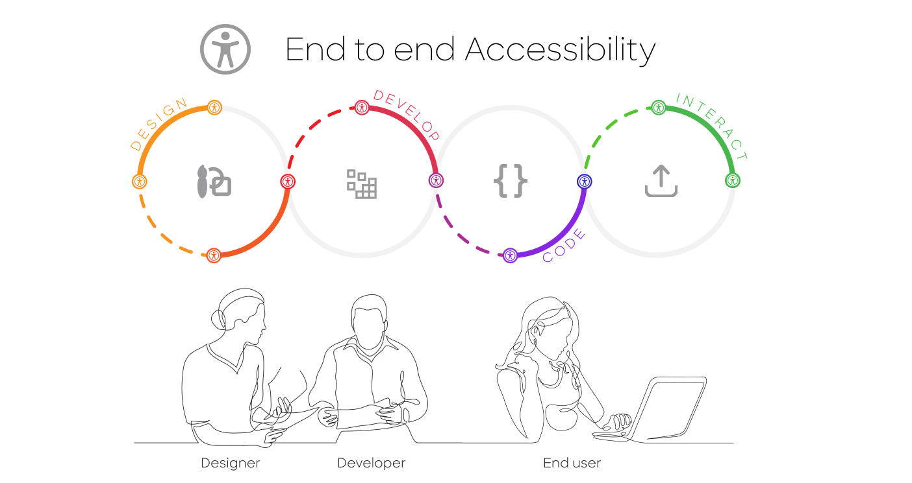

  

# Transferred
Please note that this project (and this repo) **has been transferred** under the leadership of [FINOS](https://www.finos.org).  The repo is now located here: https://github.com/finos/a11y-theme-builder/  We are excited to continue enhancing Theme Builder with the open governance and support that FINOS provides.

## Accessibility Theme Builder
 A system for generating machine readable asset types allowing design systems to publish products that are accessibly inclusive.

### Concept
Accessibility compliance is difficult. All too often accessibility is addressed late in the development and testing cycle. What if systems were designed upfront with accessible inclusion as a design principle? What if the workflow between designers and developers produced accessible components before the assembling of applications?

Adhering to an [Atomic Accessibility Design Methodology](https://finos.github.io/a11y-theme-builder/motivation/solution/), the *Accessibility Theme Builder* enables designers to systematically achieve consistent standards compliance. The system collects atomic design system variables, allowing a *Designer* to incrementally create asset types (JSON, CSS files) that can be used to:

1. publish physical and digital solutions
2. generate reusable design components that are leveraged to build physical and digital solutions

